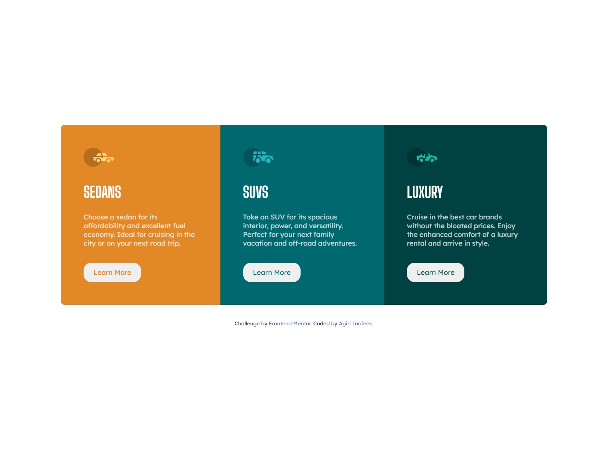

# Frontend Mentor - 3-column preview card component solution

This is a solution to the [3-column preview card component challenge on Frontend Mentor](https://www.frontendmentor.io/challenges/3column-preview-card-component-pH92eAR2-). Frontend Mentor challenges help you improve your coding skills by building realistic projects. 

## Table of contents

- [Overview](#overview)
  - [The challenge](#the-challenge)
  - [Screenshot](#screenshot)
  - [Links](#links)
- [My process](#my-process)
  - [Built with](#built-with)
  - [What I learned](#what-i-learned)
  - [Continued development](#continued-development)
  - [Useful resources](#useful-resources)
- [Author](#author)
- [Acknowledgments](#acknowledgments)

## Overview
A simple 3 rows cards in mobile view and 3 columns cards in desktop view. 
### The challenge

Users should be able to:

- View the optimal layout depending on their device's screen size
- See hover states for interactive elements

### Screenshot

### Links

- Solution URL: [Add solution URL here](https://your-solution-url.com)
- Live Site URL: [Live-site](https://elegant-lamport-23aede.netlify.app/)

## My process
as usual, I centered the content and items at the viewport and try to make the block component look so similar to the design images
### Built with

- Semantic HTML5 markup
- CSS custom properties
- Flexbox
- CSS Grid
- Mobile-first workflow

### What I learned
I was able to clear about css grid place-content and place-items properties

### Continued development

CSS is a really tricky technology, I hope to continue learning more about it to continually get better at it.

## Author
- Frontend Mentor - [@AgiriTaofeek](https://www.frontendmentor.io/profile/AgiriTaofeek)
- Twitter - [@tolanisirius](https://www.twitter.com/taofeeqomotolani)

## Acknowledgments

My man Jonas Schmedtmann😍😍